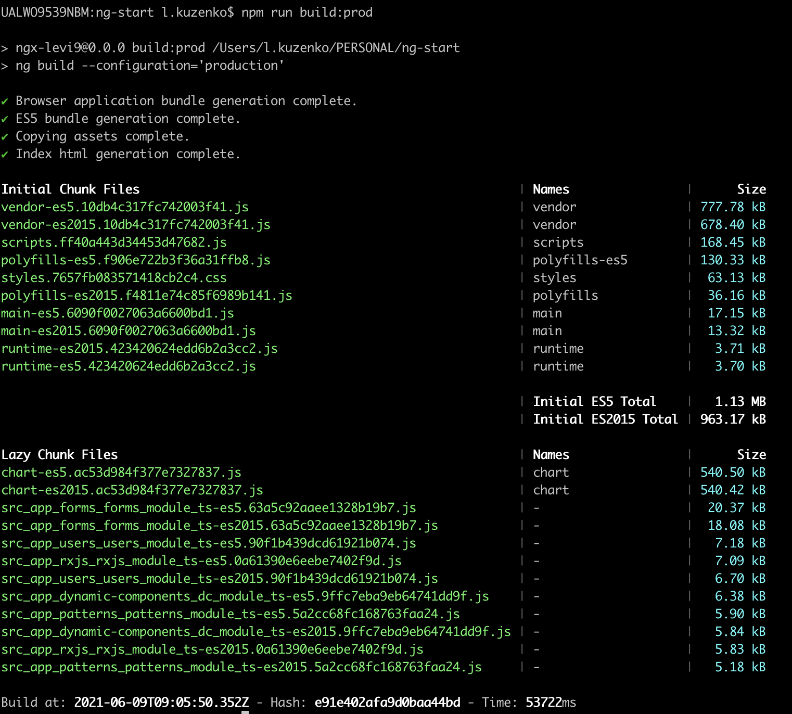
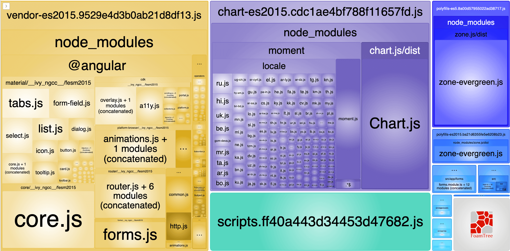

# Angular 17 Project

## Development server

Run `ng serve` for a dev server. Navigate to `http://localhost:4200/`. The app will automatically reload if you change any of the source files.

## Build

Run `ng build` to build the project. The build artifacts will be stored in the `dist/` directory.
Use the `ng build --prod --aot --build-optimizer --vendor-chunk` for more optimized build.

## Running unit tests

Run `ng test` to execute the unit tests via [Karma](https://karma-runner.github.io).

## Documentation

Visit - https://github.com/lubkoKuzenko/angular-clean-code

## Build

## webpack-bundle-analyzer

